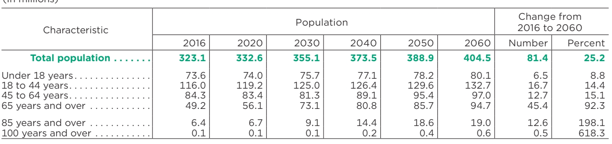

# Tabled

Tabled is a small library for detecting and extracting tables.  It uses [surya](https://www.github.com/VikParuchuri/surya) to find all the tables in a PDF, identifies the rows/columns, and formats cells into markdown, csv, or html.

## Example




| Characteristic     |       |       | Population   |       |       |       | Change from   2016 to 2060   |         |
|--------------------|-------|-------|--------------|-------|-------|-------|------------------------------|---------|
|                    | 2016  | 2020  | 2030         | 2040  | 2050  | 2060  | Number                       | Percent |
| Total population   | 323.1 | 332.6 | 355.1        | 373.5 | 388.9 | 404.5 | 81.4                         | 25.2    |
| Under 18 years     | 73.6  | 74.0  | 75.7         | 77.1  | 78.2  | 80.1  | 6.5                          | 8.8     |
| 18 to 44 years     | 116.0 | 119.2 | 125.0        | 126.4 | 129.6 | 132.7 | 16.7                         | 14.4    |
| 45 to 64 years     | 84.3  | 83.4  | 81.3         | 89.1  | 95.4  | 97.0  | 12.7                         | 15.1    |
| 65 years and over  | 49.2  | 56.1  | 73.1         | 80.8  | 85.7  | 94.7  | 45.4                         | 92.3    |
| 85 years and over  | 6.4   | 6.7   | 9.1          | 14.4  | 18.6  | 19.0  | 12.6                         | 198.1   |
| 100 years and over | 0.1   | 0.1   | 0.1          | 0.2   | 0.4   | 0.6   | 0.5                          | 618.3   |


## Community

[Discord](https://discord.gg//KuZwXNGnfH) is where we discuss future development.

# Hosted API

There is a hosted API for tabled available [here](https://www.datalab.to/):

- Works with PDF, images, word docs, and powerpoints
- Consistent speed, with no latency spikes
- High reliability and uptime

# Commercial usage

I want tabled to be as widely accessible as possible, while still funding my development/training costs. Research and personal usage is always okay, but there are some restrictions on commercial usage.

The weights for the models are licensed `cc-by-nc-sa-4.0`, but I will waive that for any organization under $5M USD in gross revenue in the most recent 12-month period AND under $5M in lifetime VC/angel funding raised. You also must not be competitive with the [Datalab API](https://www.datalab.to/).  If you want to remove the GPL license requirements (dual-license) and/or use the weights commercially over the revenue limit, check out the options [here](https://www.datalab.to).

# Installation

You'll need python 3.10+ and PyTorch. You may need to install the CPU version of torch first if you're not using a Mac or a GPU machine.  See [here](https://pytorch.org/get-started/locally/) for more details.

Install with:

```shell
pip install tabled-pdf
```

Post-install:

- Inspect the settings in `tabled/settings.py`.  You can override any settings with environment variables.
- Your torch device will be automatically detected, but you can override this.  For example, `TORCH_DEVICE=cuda`.
- Model weights will automatically download the first time you run tabled.

# Usage

```shell
tabled DATA_PATH
```

- `DATA_PATH` can be an image, pdf, or folder of images/pdfs
- `--format` specifies output format for each table (`markdown`, `html`, or `csv`)
- `--save_json` saves additional row and column information in a json file
- `--save_debug_images` saves images showing the detected rows and columns
- `--skip_detection` means that the images you pass in are all cropped tables and don't need any table detection.
- `--detect_cell_boxes` by default, tabled will attempt to pull cell information out of the pdf.  If you instead want cells to be detected by a detection model, specify this (usually you only need this with pdfs that have bad embedded text).
- `--save_images` specifies that images of detected rows/columns and cells should be saved.

After running the script, the output directory will contain folders with the same basenames as the input filenames.  Inside those folders will be the markdown files for each table in the source documents.  There will also optionally be images of the tables.

There will also be a `results.json` file in the root of the output directory. The file will contain a json dictionary where the keys are the input filenames without extensions.  Each value will be a list of dictionaries, one per table in the document.  Each table dictionary contains:

- `cells` - the detected text and bounding boxes for each table cell.
  - `bbox` - bbox of the cell within the table bbox
  - `text` - the text of the cell
  - `row_ids` - ids of rows the cell belongs to
  - `col_ids` - ids of columns the cell belongs to
  - `order` - order of this cell within its assigned row/column cell.  (sort by row, then column, then order)
- `rows` - bboxes of the detected rows
  - `bbox` - bbox of the row in (x1, x2, y1, y2) format
  - `row_id` - unique id of the row
- `cols` - bboxes of detected columns
  - `bbox` - bbox of the column in (x1, x2, y1, y2) format
  - `col_id` - unique id of the column
- `image_bbox` - the bbox for the image in (x1, y1, x2, y2) format.  (x1, y1) is the top left corner, and (x2, y2) is the bottom right corner.  The table bbox is relative to this.
- `bbox` - the bounding box of the table within the image bbox.
- `pnum` - page number within the document
- `tnum` - table index on the page

## Interactive App

I've included a streamlit app that lets you interactively try tabled on images or PDF files.  Run it with:

```shell
pip install streamlit
tabled_gui
```

## From python

```python
from tabled.extract import extract_tables
from tabled.fileinput import load_pdfs_images
from tabled.inference.models import load_detection_models, load_recognition_models

det_models, rec_models = load_detection_models(), load_recognition_models()
images, highres_images, names, text_lines = load_pdfs_images(IN_PATH)

page_results = extract_tables(images, highres_images, text_lines, det_models, rec_models)
```

# Benchmarks

|   Avg score |   Time per table |   Total tables |
|-------------|------------------|----------------|
|       0.847 |            0.029 |            688 |

## Quality

Getting good ground truth data for tables is hard, since you're either constrained to simple layouts that can be heuristically parsed and rendered, or you need to use LLMs, which make mistakes.  I chose to use GPT-4 table predictions as a pseudo-ground-truth.

Tabled gets a `.847` alignment score when compared to GPT-4, which indicates alignment between the text in table rows/cells.  Some of the misalignments are due to GPT-4 mistakes, or small inconsistencies in what GPT-4 considered the borders of the table.  In general, extraction quality is quite high.

## Performance

Running on an A10G with 10GB of VRAM usage and batch size `64`, tabled takes `.029` seconds per table.

## Running the benchmark

Run the benchmark with:

```shell
python benchmarks/benchmark.py out.json
```

# Acknowledgements

- Thank you to [Peter Jansen](https://cognitiveai.org/) for the benchmarking dataset, and for discussion about table parsing.
- Huggingface for inference code and model hosting
- PyTorch for training/inference